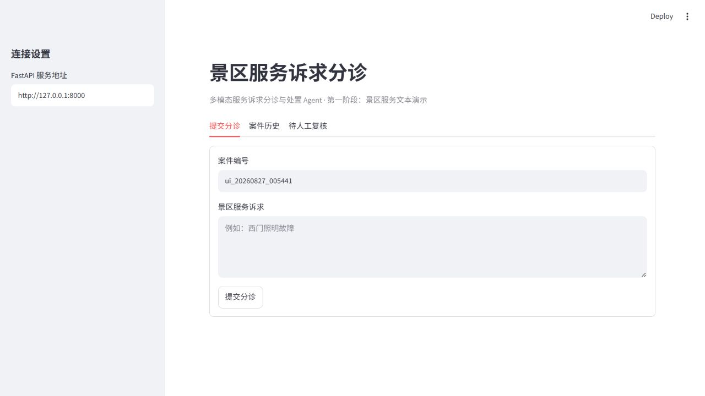
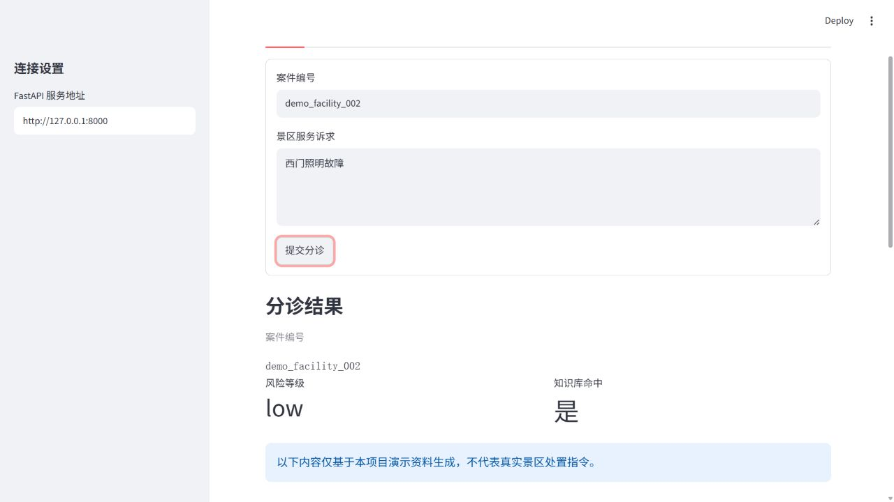
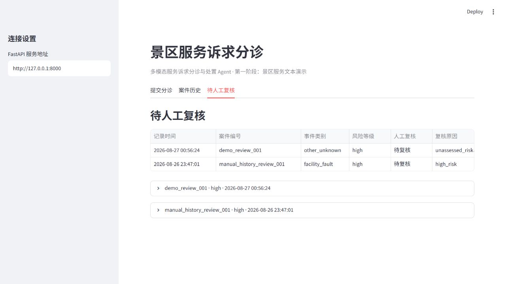

# 多模态服务诉求分诊与处置 Agent

景区服务文本诉求分诊与处置辅助决策 Demo。

## MVP 范围

- 仅支持景区服务文本输入。
- 使用 Pydantic 校验 JSON 输出。
- 高风险、知识库未命中、字段缺失与模型解析失败均转人工复核。
- 只使用演示数据和可追溯知识引用。
- 默认使用免费的本地确定性演示模型，不调用外部 API。

## 项目文档

- [系统架构说明](docs/architecture.md)：组件职责、数据流和安全边界。
- [演示与录屏脚本](docs/demo-script.md)：答辩时可按此顺序演示本项目。

所有规则、知识资料和处理建议均为演示数据。它们不代表真实景区服务规则、真实处置角色、
服务时限或模型准确率。

## 暂不实现

- 图片输入。
- 真实业务系统、真实个人数据和线上调度。
- 高风险事件的自动最终决策。

## 终端演示

在已激活的 `service-request-agent` Conda 环境中运行：

```powershell
python scenarios\scenic_service\run_demo_agent.py "西门照明故障"
```

## 本地启动

请打开两个 PowerShell 窗口，并都切换到项目目录、激活同一个 Conda 环境。第一窗口启动 API：

```powershell
conda activate service-request-agent
Set-Location E:\project\agent\service-request-agent
python -m uvicorn app.api.main:app --reload
```

然后在浏览器打开 `http://127.0.0.1:8000/docs`，使用
`POST /api/v1/triage` 接口测试文本诉求。

第二窗口启动 Streamlit 操作页面：

```powershell
conda activate service-request-agent
Set-Location E:\project\agent\service-request-agent
python -m streamlit run app\ui\streamlit_app.py
```

浏览器打开 `http://127.0.0.1:8501`。在页面中输入案件编号和景区服务诉求，页面会调用
本地 API，并只展示再次通过 Pydantic 校验的案件 JSON。默认的模拟模型完全在本机运行，
不需要 API Key。

## 可选：接入 OpenAI-compatible 模型

默认的 `LLM_PROVIDER=demo` 使用免费的本地确定性演示模型，不会调用任何外部 API。
项目已经封装了 OpenAI-compatible 的 `/chat/completions` 提供方；只有在**重启 FastAPI
之前**显式设置下列 PowerShell 环境变量时，才会向你选择的模型服务发送请求：

```powershell
$env:LLM_PROVIDER = "openai_compatible"
$env:OPENAI_COMPATIBLE_BASE_URL = "https://你的兼容接口根地址/v1"
$env:OPENAI_COMPATIBLE_API_KEY = "你的密钥"
$env:OPENAI_COMPATIBLE_MODEL = "你的模型名称"
$env:OPENAI_COMPATIBLE_TIMEOUT_SECONDS = "30"
$env:OPENAI_COMPATIBLE_STRUCTURED_OUTPUT_MODE = "json_object"
python -m uvicorn app.api.main:app --reload
```

`.env.example` 只是一份不含真实密钥的配置参考，当前项目不会自动读取 `.env` 文件。
可将接口根地址和模型名称替换为 Qwen 或其他服务商提供的 OpenAI-compatible 参数；是否收费、
额度和模型能力由对应服务商决定。无论使用哪个提供方，原始模型输出仍会经过 Pydantic 校验；
调用失败、输出无法解析或不符合契约时，系统都会转人工复核。

## 本地操作页面

启动命令见上方“本地启动”。页面包含“提交分诊”“案件历史”和“待人工复核”三个标签页。

## 本地案件历史与人工复核

每次调用分诊接口产生的 Pydantic 案件结果都会保存在本机的
`data/case_history.sqlite3`。数据库文件已经被 Git 忽略，不会提交到 GitHub；
它只用于项目演示，不应写入真实个人数据。

- `GET /api/v1/case-history`：查看最近 100 条本地案件结果。
- `GET /api/v1/review-queue`：查看最近 100 条必须人工复核的案件。

Streamlit 页面也提供“案件历史”和“待人工复核”两个标签页。历史记录只保存已经
校验的结果 JSON，不单独保存原始请求体；结果中原本用于审计的证据或诊断字段会保留。
待人工复核列表由结果中的 `requires_human_review=true` 自动生成，绝不自动标记为已复核。

## 演示场景配置

景区服务的演示规则不再直接写在 Python 判断语句中，统一放在以下文件：

- `scenarios/scenic_service/scenario.yaml`：当前可识别的演示事件和关键词组合。
- `scenarios/scenic_service/risk_rules.yaml`：命中后必须升级人工复核的演示高风险词。
- `scenarios/scenic_service/routing.yaml`：低风险设施故障可展示的演示建议及其知识来源。

这些内容全部是项目演示配置，不代表真实景区角色、调度路径或服务时限。配置文件会在
FastAPI 启动时经 Pydantic 校验；修改 YAML 后，请重启 FastAPI 服务再测试。

## 演示评估

项目提供一组可重复执行的景区服务演示案例，用于验证低风险设施故障、字段缺失、
高风险强制人工复核、知识库未命中、模型输出解析失败和模型调用失败等安全边界。
在已激活的 `service-request-agent` 环境中运行：

```powershell
python -m app.evaluation
```

命令会输出一份经过 Pydantic 校验的 JSON 报告；全部案例符合预期时退出码为 `0`，
否则为 `1`。案例文件位于
`scenarios/scenic_service/evaluation_cases.yaml`。它只验证本项目的演示规则和安全
约束，不代表真实景区服务规则，也不宣称模型准确率。

## 测试

运行全部测试：

```powershell
python -m pytest
```

只验证场景配置及其与模拟模型的连接：

```powershell
python -m pytest tests\rules\test_scenic_service_config.py
```

只验证评估模块：

```powershell
python -m pytest tests\evaluation\test_runner.py
```

## 演示截图

以下截图只展示本项目的本地演示数据，不含 API Key、真实个人信息或真实业务记录：

提交页面：



低风险、知识库命中的演示结果：



高风险演示案例进入人工复核队列：



## Docker 启动（可选）

Docker 配置会启动 FastAPI 和 Streamlit 两个容器，并默认使用免费的 `demo` 模型，
因此不需要 API Key。首次使用前需要安装并启动 Docker Desktop；本电脑当前尚未检测到
Docker 命令，所以尚未在本机实际启动容器。

安装 Docker Desktop 后，请先停止占用 `8000`、`8501` 端口的本地服务，再在项目根目录运行：

```powershell
docker compose up --build
```

然后打开 `http://127.0.0.1:8501`。结束容器并保留本地数据卷：

```powershell
docker compose down
```

`compose.yaml` 会保存 ChromaDB 和案件历史的容器数据卷。以后若要切换 OpenAI-compatible
模型，只能在本机终端临时设置环境变量后再启动 Compose；不要把真实密钥写入
`compose.yaml`、README、截图或 Git 仓库。
